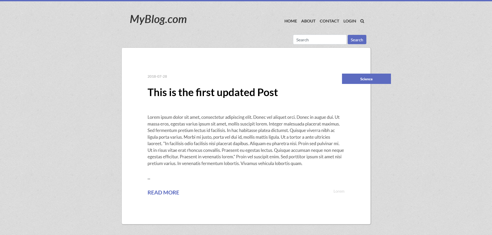

# webEngine

## Introduction

webEngine can be considered as a minimalistic framework for building custom made Content Management System (CMS) to support any kind of interactive & dynamic web based application like Blog, Ecommerce, Personal/Portfolio website etc. The skeleton can be engineered to be transformed into a customizable, extensible and scaled web platform.

## Technolgoies

* PHP 7.2.4
* MySQL
* Javascript
* HTML 5, CSS 3 & Bootstrap

## Instruction

* Clone this repo:
```
git clone https://github.com/SazzadSH/Web-CMS
```

* Run PHP & MySQL serve.
* Import the database from 'db' folder to the machine.
* Run the app from a web browser.

## Screenshots

### FrontEnd

### BackEnd
